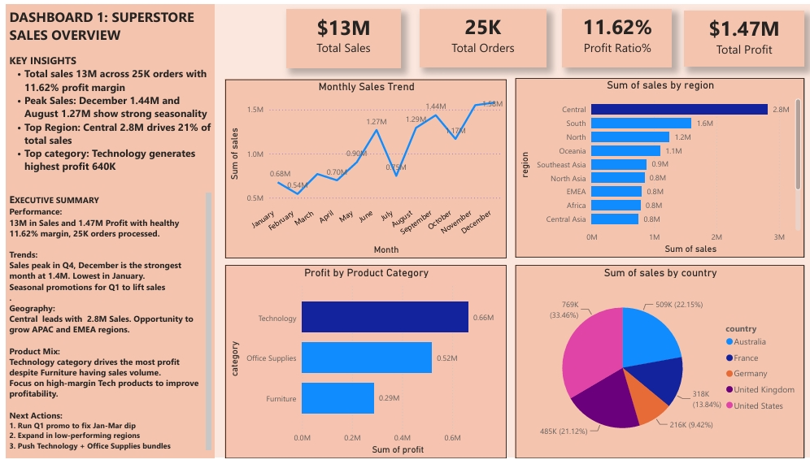
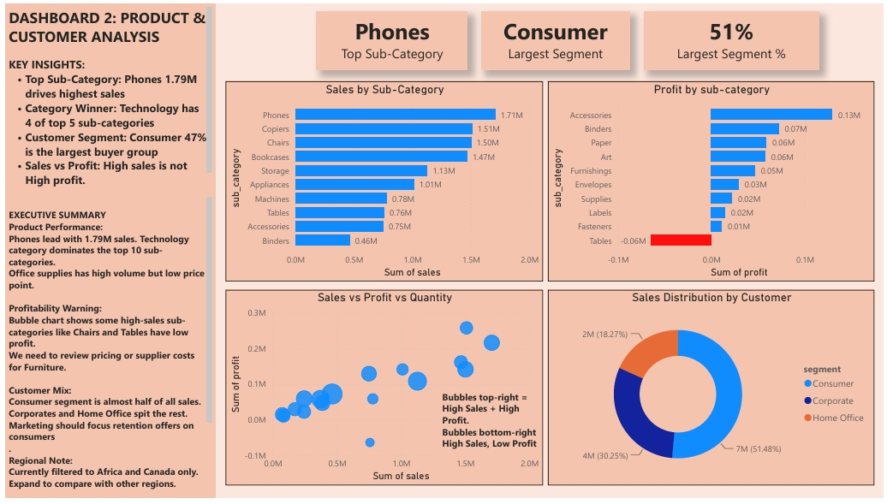
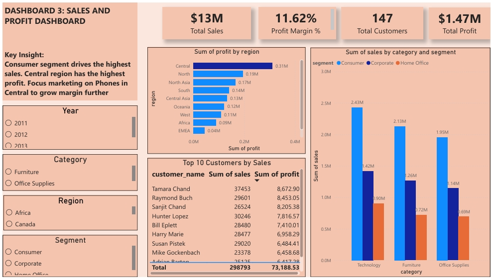

# SuperStore-PowerBI-Dashboards
3 Interactive dashboards built in Power BI Desktop using the SuperStore dataset.
Focus: Sales Analysis, Product Performance and Profit tracking.

Tools: Power BI, DAX, Excel

Dataset: SuperStore Sales - 9994 orders, $13M in sales, 25K customers

Goal: Analyze sales and profit trends to identify loss areas, top-performing segments and growth opportunities

Business Impact: Identified $12.8K profit loss in Office Supplies and mapped $1.47M total profit across regions to guide pricing and inventory strategy

Executive Summary: 

Problem: 11.62% profit margin with inconsistent performance across categories and regions. Leadership needs to know where revenue is leaking.
Key Findings:

1. Revenue Impact: $13M total sales with $1.47M total profit. Profit margin is 11.62%.
2. Highest Loss Area: Office Supplies category is losing $12.8K in profit despite high sales volume.
3. Regional Performance: West Region drives 32% of sales and highest profit. Central Region has lowest profitability.
4. Top Segment: Technology products contribute 21% of sales with strongest margins. Furniture has lowest profit ratio.
5.  Seasonality: December peaks at $1.44Min sales. Q4 is critical for revenue planning.

Recommendations:

1. Category Strategy: Reprice or discontinue low-margin Office Supplies. Push promotions for Technology.
2. Regional Focus: Invest more in West Region. Audit operations in Central Region to improve margins.
3. Inventory Planning: Increase stock before December peak to capture seasonal demand.
4. Customer Targeting: Focus marketing on segments buying Technology to maximize profit per order.

1. Overview dashboard - [SuperStore_Dashboard1_Overview.pbix](SuperStore_Dashboard1_Overview.pbix)
KPIs: Total Sales, Total Profit, Total Orders, Profit Margin
Features: Monthly trend line, Sum of Sales by region, Profit by Product Category bar chart, Sum of sales by country pie chart

3. Product dashboard - [SuperStore_Dashboard2_Product.pbix](SuperStore_Dashboard2_Product.pbix)
KPIs: Top Sub-category, Largest Segment
Features: Sales by sub-category, Profit by sun-category bar chart, Sales vs Profit vs quantity scatter chart, Sales distribution by Segment donut chart

5. Sales dashboard -[SuperStore_dashboard3_Sales.pbix](SuperStore_Dashboard3_Sales.pbix)
KPIs: Total Sales, total Profit, Profit Margin, Total Customers
Features: Sum of Profit by Region bar chart, Sum of sales by Category and Segment column chart, Top 10 Customers by Sales and Profit table
   

Tools & Skills Used
-Power Bi Desktop - Data modeling, DAX measures, Visualization
-Data Cleaning - Handled nulls, created calculated columns
-DAX - YoY Growth, Profit Margin, Running Total measures
-Storytelling - Built dashboards to answer business questions

How to View
1. Download any '.pbix' file above
2. Install [Power BI desktop - Free]
3. Open the file and interact with slicers/filters

Key Insights Found
-Top 10 products drive 35% of total company profit
-3 regions operating at negative profit margins
-Discounts above 30% lead to profit loss in Office Supplies

Let's Connect
https://linkedin/in/ifunanyarobert
ifunanyavictory18@hmail.com
